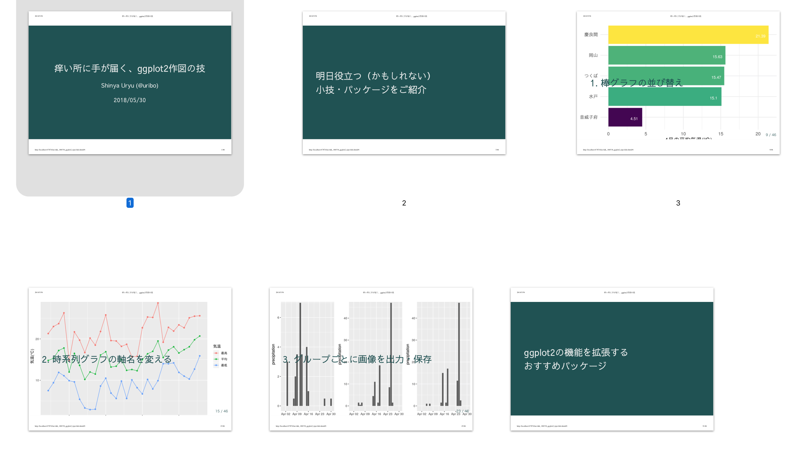

痒い所に手が届くggplot2作図の技
================

Author: Shinya Uryu ([\@uribo](https://github.com/uribo))



## Running

## Local

From R

```r
install.packages("usethis")
usethis::use_course("https://github.com/uribo/talk_180530_ggplot2_tips/archive/master.zip")
```

## Docker

```bash
docker-compose up --build
```

## References

- [ggplot2をつかってみる](https://github.com/ito4303/esj65)
- [ggplot2再入門](https://speakerdeck.com/yutannihilation/ggplot2zai-ru-men)

## Session Information

```r
R version 3.5.0 (2018-04-23)
Platform: x86_64-pc-linux-gnu (64-bit)
Running under: Debian GNU/Linux 9 (stretch)

Matrix products: default
BLAS: /usr/lib/openblas-base/libblas.so.3
LAPACK: /usr/lib/libopenblasp-r0.2.19.so

locale:
 [1] LC_CTYPE=en_US.UTF-8       LC_NUMERIC=C               LC_TIME=en_US.UTF-8       
 [4] LC_COLLATE=en_US.UTF-8     LC_MONETARY=en_US.UTF-8    LC_MESSAGES=C             
 [7] LC_PAPER=en_US.UTF-8       LC_NAME=C                  LC_ADDRESS=C              
[10] LC_TELEPHONE=C             LC_MEASUREMENT=en_US.UTF-8 LC_IDENTIFICATION=C       

attached base packages:
[1] stats     graphics  grDevices utils     datasets  methods   base     

other attached packages:
 [1] egg_0.2.0              gridExtra_2.3          gghighlight_0.0.1.9000 ggrepel_0.8.0         
 [5] gganimate_0.1.0.9000   lubridate_1.7.4        bindrcpp_0.2.2         forcats_0.3.0         
 [9] stringr_1.3.1          dplyr_0.7.5            purrr_0.2.5            readr_1.1.1           
[13] tidyr_0.8.0            tibble_1.4.2           ggplot2_2.2.1.9000     tidyverse_1.2.1       
[17] xaringanthemer_0.1.1  

loaded via a namespace (and not attached):
 [1] tidyselect_0.2.4  reshape2_1.4.3    haven_1.1.1       lattice_0.20-35   colorspace_1.3-2 
 [6] htmltools_0.3.6   yaml_2.1.19       utf8_1.1.4        rlang_0.2.0.9001  pillar_1.2.3     
[11] foreign_0.8-70    glue_1.2.0.9000   withr_2.1.2       modelr_0.1.1      readxl_1.1.0     
[16] bindr_0.1.1       plyr_1.8.4        munsell_0.4.3     gtable_0.2.0      cellranger_1.1.0 
[21] rvest_0.3.2       evaluate_0.10.1   psych_1.8.3.3     labeling_0.3      knitr_1.20       
[26] parallel_3.5.0    broom_0.4.4       Rcpp_0.12.17      scales_0.5.0.9000 backports_1.1.2  
[31] jsonlite_1.5      mnormt_1.5-5      digest_0.6.15     hms_0.4.2         stringi_1.2.2    
[36] grid_3.5.0        rprojroot_1.3-2   here_0.1          cli_1.0.0         tools_3.5.0      
[41] magrittr_1.5      lazyeval_0.2.1    crayon_1.3.4      pkgconfig_2.0.1   rsconnect_0.8.8  
[46] xml2_1.2.0        rmarkdown_1.9     assertthat_0.2.0  httr_1.3.1        rstudioapi_0.7   
[51] R6_2.2.2          nlme_3.1-137      compiler_3.5.0 
```
