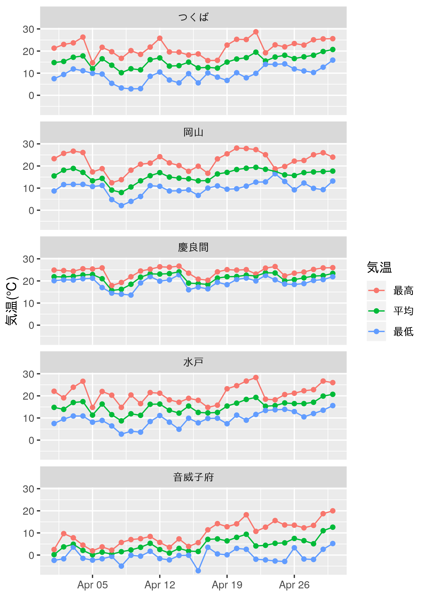
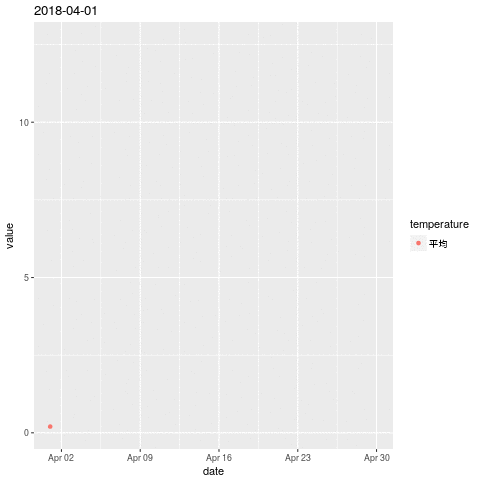
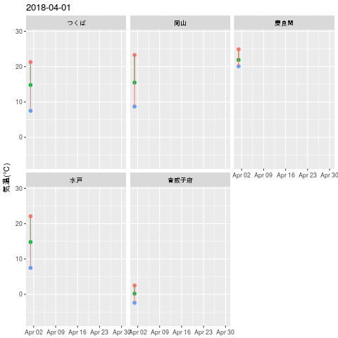
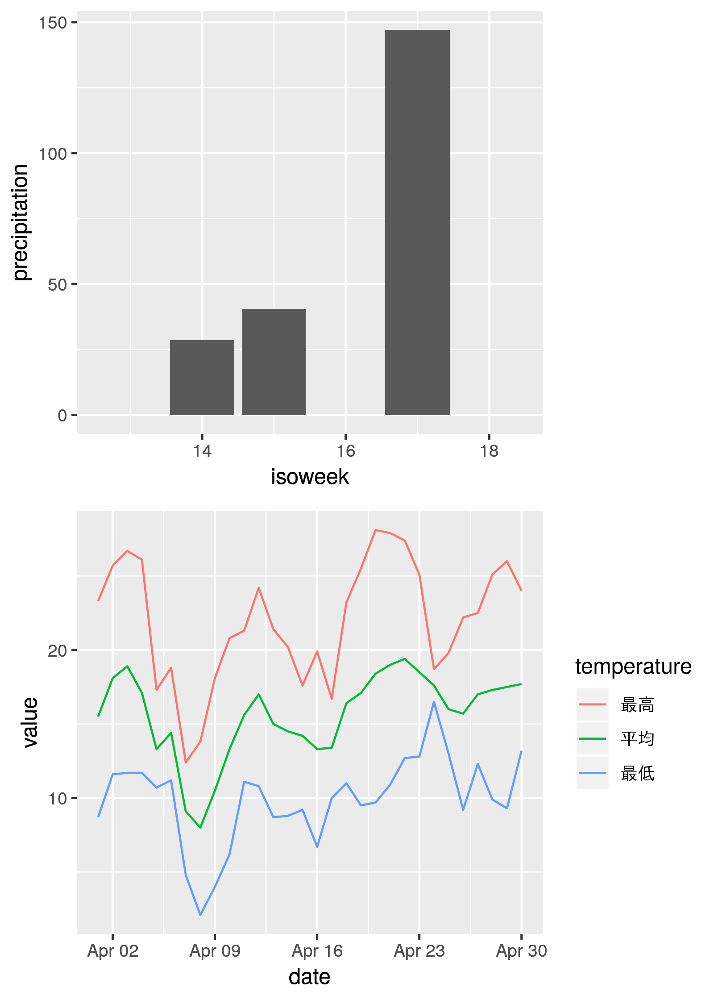

```{r setup, include = FALSE, purl = TRUE}
library(xaringanthemer)
options(htmltools.dir.version = FALSE)
knitr::opts_chunk$set(dpi = 320)
```

```{r xaringan-themer, include = FALSE, purl = FALSE}
font_sawarabi <- google_font("Sawarabi Gothic")
font_sawarabi$url <- "https://fonts.googleapis.com/earlyaccess/sawarabigothic.css"
font_mplus <- google_font("Mplus 1p")
font_mplus$url <- "https://fonts.googleapis.com/earlyaccess/mplus1p.css"

mono_light(
  base_color = "#1c5253",
  header_font_google = font_sawarabi,
  text_font_google   = font_mplus,
  code_font_google   = google_font("Droid Mono"),
  link_color = "#A1C5AB"
)
```

class: center, middle
# 「ggplot2で作図する」

### あの図を描くにはどうするんだ？

あるいは

### 標準plotをggplot2で描画するには？

ということがよくある

---
class: inverse, middle
# 明日役立つ（かもしれない）<br>小技・パッケージをご紹介

--
コードは[GitHub](https://github.com/uribo/talk_180530_ggplot2_tips)上で公開しています<br>
（Rmarkdownでのスライド（このファイル）もあります）

駆け足で紹介していく、かつ<br>
追加でインストールが必要なパッケージもあると思うので<br>
発表中はコードを追わない（実行しない）で結構です

---
background-image: url(images/load_ggplot2.png)
background-size: cover
class: center, middle

<!-- ggplot2(2.2.1.9000)で実行。2.3.0が来月リリース予定 -->

---
class: inverse, middle, center
# tidyverseパッケージとの組み合わせ技

---
## 利用するデータ・パッケージ

Rによるデータ分析を行う上で便利なパッケージ群

```{r, echo = TRUE}
library(tidyverse)
```

**tidyverse**では上記のパッケージが同時に利用可能になります

今回の話で主となる**ggplot2**も**tidyverse**に含まれます

---
## 利用するデータ・パッケージ

- [気象庁ホームページ](http://www.data.jma.go.jp/obd/stats/etrn/index.php)で公開されている過去の気象データ
- 2018年4月の4地点の降水量、気温(平均、最高、最低)

```{r}
source("jma-4stations-weather.R")
# データの一部を表示
glimpse(df_weather)
```

---
class: middle
background-image: url(images/plot1-brashup.png)
background-size: cover

# 1. 棒グラフの並び替え

---
## まずは普通に作成

作図用のデータを用意。観測地点ごとの平均気温の平均を求める

.pull-left[
```{r}
df_weather4plot <- 
  df_weather %>% 
  group_by(block_no, station_name) %>% 
  summarise(
    temp_mean = mean(temp_mean, 
                     na.rm = TRUE)) %>% 
  ungroup()
```
]

.pull-right[
```{r}
df_weather4plot
```
]

---
## まずは普通に作成

- どういう順序なのかわかりにくい

.pull-left[
```{r plot1_raw, eval = FALSE, echo = TRUE}
df_weather4plot %>% 
  ggplot(aes(station_name, temp_mean)) +
  geom_bar(stat = "identity")
```
]

.pull-right[
```{r, ref.label = "plot1_raw", echo = FALSE, fig.width = 6, fig.height = 5}
```
]

---
## forcatsパッケージで因子型に変換

- `fct_reorder()`... 他の変数の値を基準とする
- `fct_inorder()`... 要素が出現した順
- etc.

```{r}
df_weather4plot$station_name

# station_name変数を因子型に変換
df_weather4plot %>% 
  mutate(station_name = fct_reorder(station_name, temp_mean)) %>% 
  magrittr::use_series(station_name)
```

---
## 要素の並び替え

.pull-left[
```{r plot1, eval = FALSE, echo = TRUE}
# 平均気温の平均値が小さい順に
plot1 <- 
  df_weather4plot %>% 
  ggplot(
    aes(fct_reorder(station_name, temp_mean), 
        temp_mean)) +
  geom_bar(stat = "identity")

plot1
```
]

.pull-right[
```{r, ref.label="plot1", echo = FALSE, fig.width = 6, fig.height = 5}
```

]

---
## ブラッシュアップ

.pull-left[
```{r update_plot1, eval = FALSE, echo = TRUE}
plot1 +
  # 棒ごとに色をつける
  geom_bar(stat = "identity", 
           aes(fill = temp_mean)) +
  # 値を棒の中に表示
  geom_text(
    aes(x = station_name,
        y = temp_mean - max(temp_mean) * 0.05,
        label = round(temp_mean, digits = 2)),
    vjust = 1,
    color = "white") +
  # 図を縦にする
  coord_flip() +
  xlab(NULL) +
  scale_fill_continuous(type = "viridis") +
  ylab(paste0("4月の平均気温", "(\u2103)")) +
  theme_minimal(base_size = 16) +
  guides(fill = FALSE)
```
]

.pull-right[
```{r, ref.label="update_plot1", echo = FALSE, fig.width = 6, fig.height = 5}
```
]

---
class: middle
background-image: url(images/plot2-brashup.png)
background-size: cover
# 2. 時系列グラフの軸名を変える

---
## まずは普通に作成


- 「岡山」の4月の平均気温をプロット
- x軸のラベルが潰れている

.pull-left[
```{r raw_plot2, eval = FALSE, echo = TRUE, message = FALSE}
df_weather %>% 
  filter(station_name == "岡山") %>% 
  ggplot(
    aes(date, temp_mean, 
        group = block_no)) +
  geom_point() +
  geom_line()
```
]

.pull-right[
```{r, ref.label = "raw_plot2", echo = FALSE, fig.width = 6, fig.height = 5}
```
]

---
## lubridateパッケージで日付データをよしなに扱う

```{r}
class(df_weather$date[1])
```

**lubridate**はtidyverseに含まれないので追加で読み込み

- `lubridate::ymd()`... 日付形式の文字列をパースして日付データに変換

```{r, message = FALSE}
library(lubridate)
class(ymd(df_weather$date[1]))
```

---
## lubridateパッケージで日付データをよしなに扱う

```{r}
df_weather <- 
  df_weather %>% 
  mutate(date = ymd(date))

# date列が<date>となっているのを確認
head(df_weather)
```

---
## lubridateパッケージで日付データをよしなに扱う

.pull-left[
```{r plot2, eval = FALSE, echo = TRUE, message = FALSE}
plot2 <- 
  df_weather %>% 
  filter(station_name == "岡山") %>% 
  ggplot(
    aes(date, temp_mean, 
        group = block_no)) +
  geom_point() +
  geom_line()

plot2
```
]

.pull-right[
```{r, ref.label = "plot2", echo = FALSE, fig.width = 6, fig.height = 5}
```
]

---
## tidyr、dplyrでデータの加工

- `tidyr::gather()`... 項目と値からなる変数の組み合わせを作る

```{r}
df_temperature_gather <- df_weather %>% 
  # 3種類の変数からなる
  # 「気温 temperature」の種類とその「値 value」を一対の変数に整形
  gather("temperature", "value", 
         temp_mean, temp_max, temp_min)

glimpse(df_temperature_gather)
```

---
## tidyr、dplyrでデータの加工

- `dplyr::recode()`... ベクトルの値を任意の値に変換

```{r}
df_temperature_gather <- df_temperature_gather %>% 
  # 変数名だった値を日本語の値に直し、fct_reorder()で因子にする(valueの大きさ順)
  mutate(temperature = recode(temperature,
                              temp_mean = "平均",
                              temp_max  = "最高",
                              temp_min  = "最低") %>% 
      fct_reorder(value, .desc = TRUE))

df_temperature_gather %>% 
  distinct(station_name, temperature) %>% 
  glimpse()
```


---
## ブラッシュアップ

.pull-left[
```{r plot2_update, eval = FALSE, echo = TRUE}
df_temperature_gather %>% 
  ggplot(aes(date, value, 
             group = temperature, 
             color = temperature)) +
  geom_point() + geom_line() +
  # x軸の表記を調整
  scale_x_date(date_labels = "%b %d", 
               date_breaks = "7 day") +
  xlab(NULL) +
  ylab(paste0("気温", "(\u2103)")) +
  guides(color = guide_legend(title = "気温")) +
  # station_nameごとに領域を分割
  facet_wrap(~ station_name, nrow = 5)
```
]

.pull-right[

]

---
class: middle
background-image: url(images/plot3.png)
background-size: cover
# 3. グループごとに画像を出力・保存

---
## こんなことをしていませんか?

同じ図の繰り返しの出力

```{r, eval = FALSE, echo = TRUE, purl = FALSE}
df_weather %>% 
  filter(station_name == "つくば") %>% 
  ggplot(., aes(date, precipitation)) + geom_bar(stat = "identity")

df_weather %>% 
  filter(station_name == "岡山") %>% 
  ggplot(., aes(date, precipitation)) + geom_bar(stat = "identity")

df_weather %>% 
  filter(station_name == "慶良間") %>% 
  ggplot(., aes(date, precipitation)) + geom_bar(stat = "identity")

# ... 以下対象のグループごとに実行
```

ダメではないけど効率が悪い・間違いをおかしやすい

---
## tidyr + purrrでグループ処理

- `tidyr::nest()`... データフレームの変数にデータフレームを入れ子にする


```{r}
df_weather4plot <- 
  df_weather %>% 
  # 入れ子にする変数を選択
  nest(date, precipitation, starts_with("temp_"))

# dataという変数ができる
df_weather4plot
```

---
## tidyr + purrrでグループ処理

```{r}
# data変数に観測地点ごとのデータが格納されている
head(df_weather4plot$data[[1]]) # 音威子府
```

---
## tidyr + purrrでグループ処理

- `purrr::map()`... ベクトルの要素に対して処理を繰り返す

```{r}
# 作図の結果をplot変数に格納
df_group_out <- 
  df_weather4plot %>% 
  mutate(
    plot = map(# 対象の変数（入れ子にしたデータ）
               data,
               # 無名関数を定義
              ~ ggplot(., aes(date, precipitation)) +
                geom_bar(stat = "identity"))
  )
```

---
## tidyr + purrrでグループ処理

- `tidyr::unnest()`... 入れ子になった変数を元に戻す

```{r}
df_group_out %>% 
  # 新たにplot変数が作成されている
  unnest(data, .preserve = plot) %>% 
  glimpse()
```

---
## tidyr + purrrでグループ処理

plotを表示するには要素を参照する

.pull-left[
```{r, fig.width = 5, fig.height = 4}
df_group_out$plot[[1]] # 音威子府
```
]

.pull-right[
```{r, fig.width = 5, fig.height = 4}
df_group_out$plot[[5]] # 慶良間
```
]

---
## tidyr + purrrでグループ処理

- `purrr::walk2()`... 出力を伴わない`map()`。2要素を指定する。

```{r, eval = FALSE, echo = TRUE}
# .x = 保存するファイルの名前
# .y = 出力の対象
# .f = 要素へ適用する処理
walk2(.x = paste0("images/april-precipitation-", df_group_out$block_no, ".png"),
      .y = df_group_out$plot,
      .f = ggsave,
      width = 4, height = 3)
```

```{r, echo = FALSE, purl  = FALSE, fig.width = 12, fig.height = 3}
egg::ggarrange(df_group_out$plot[[1]], df_group_out$plot[[2]], df_group_out$plot[[3]], nrow = 1)
```


---
class: inverse middle
# ggplot2の機能を拡張する<br>おすすめパッケージ

---
class: inverse middle
# 1. gganimate: アニメーションを作成する

---
### GitHubからインストール

CRANには登録されていません。下記の方法でインストールしてください。

```{r, eval = FALSE, echo = TRUE}
install.packages("remotes")
remotes::install_github("dgrtwo/gganimate")
```

```{r}
library(gganimate)
```

---
## gganimate

- *frame*引数にアニメーションさせる対象の変数を指定
- `gganimate()`で描画・保存

.pull-left[
```{r}
# 日毎の平均気温の推移を描画
plot4 <- 
  df_temperature_gather %>% 
  filter(station_name == "音威子府", 
         temperature == "平均") %>% 
  select(date, temperature, value) %>%
  # frame = アニメーションの対象
  ggplot(
    aes(date, value, 
        color = temperature, 
        frame = date)) +
  geom_point()
```
]

.pull-right[
```{r, eval = FALSE, echo = TRUE}
gganimate(plot4)
```



]

---
## ブラッシュアップ

.pull-left[
```{r, eval = FALSE, echo = TRUE}
df_temperature_gather %>% 
  select(date, station_name, 
         temperature, value) %>%
  ggplot(aes(date, value, 
             color = temperature, 
             frame = date,
             group = station_name,
             cumulative = TRUE)) +
  geom_point(size = 2) +
  geom_line() +
  guides(color = FALSE) +
  xlab(NULL) +
  ylab(paste0("気温", "(\u2103)")) +
  facet_wrap(~ station_name)
```
]

.pull-right[

]

---
class: inverse middle
# 2. ggrepel: テキスト、ラベルの<br>配置をよしなに

---
## あまり良い例ではないですが...

.pull-left[
```{r}
library(ggrepel)

df_okym <- 
  df_temperature_gather %>% 
  filter(station_name == "岡山")
```

```{r plot5, eval = FALSE, echo = TRUE}
df_okym %>% 
  ggplot(aes(date, value, 
             label = temperature,
             color = temperature)) +
  geom_point() + geom_line() +
  geom_label_repel(data = df_okym %>% 
                     group_by(temperature) %>% 
                     arrange(desc(date)) %>% 
                              slice(1L),
                           size = 5,
                           nudge_x = 0.25) +
  guides(color = FALSE)
```
]

.pull-right[
```{r, ref.label="plot5", echo = FALSE, fig.width = 6, fig.height = 5}
```
]

---
class: inverse middle
# 3. gghighlight: 要素の一部をハイライト

---
## GitHubからインストール

CRANに登録されていますが、開発版の機能を紹介します

```{r, eval = FALSE, echo = TRUE}
remotes::install_github("yutannihilation/gghighlight")
```

```{r}
library(gghighlight)
```

---
## 関心のあるデータに焦点をあてる

- `geom_highlight()`... 条件を指定してハイライトを可能にする

.pull-left[
```{r plot6, eval = FALSE, echo = TRUE, message = FALSE}
df_temperature_gather %>% 
  filter(temperature == "平均") %>% 
  ggplot() +
  geom_line(aes(date, value, 
                group = station_name)) +
  geom_highlight(grepl("(岡山|つくば)", 
                       station_name))
```
]

.pull-right[
```{r, ref.label="plot6", echo = FALSE, warning = FALSE, fig.width = 6, fig.height = 5}
```
]

---
class: inverse middle
# 4. egg: グラフ配置を自在に操る

---
## 異なる要素の図を一枚にまとめたい

例) 週ごとの降水量合計と、日ごとの気温の変化を一枚に

```{r}
df_okym_weekly_precipitation <- 
  df_okym %>% 
  # isoweek()はlubridateの関数
  mutate(isoweek = isoweek(date)) %>% 
  group_by(isoweek) %>% 
  summarise(precipitation = sum(precipitation))
```

```{r, include = FALSE}
df_okym_weekly_precipitation
```

---
## それぞれの図を用意する

.pull-left[
```{r}
plot7_a <- 
  df_okym_weekly_precipitation %>% 
  ggplot(aes(isoweek, precipitation)) +
  geom_bar(stat = "identity")
```
]

.pull-right[
```{r}
plot7_b <- 
  df_okym %>% 
  ggplot() +
  geom_line(aes(date, value, 
                color = temperature))
```
]

---
## eggで配置を整える

- `ggarrange()`... 複数のggplotオブジェクトの配置を調節

.pull-left[

```{r, message = FALSE}
library(egg)
```

```{r plot7_1col, eval = FALSE, echo = TRUE}
ggarrange(plot7_a, plot7_b, nrow = 2)
```
]

.pull-righht[

]

---
## eggで配置を整える

.pull-left[
```{r plot7_2col, eval = FALSE, echo = TRUE}
ggarrange(plot7_a, plot7_b, nrow = 1)
```
]

.pull-right[
```{r, ref.label = "plot7_2col", echo = FALSE, fig.width = 6, fig.height = 5}
```
]

---
class: inverse, middle, center
# Enjoy!

こんな図が描きたい等、ご要望あればお問い合わせください！
